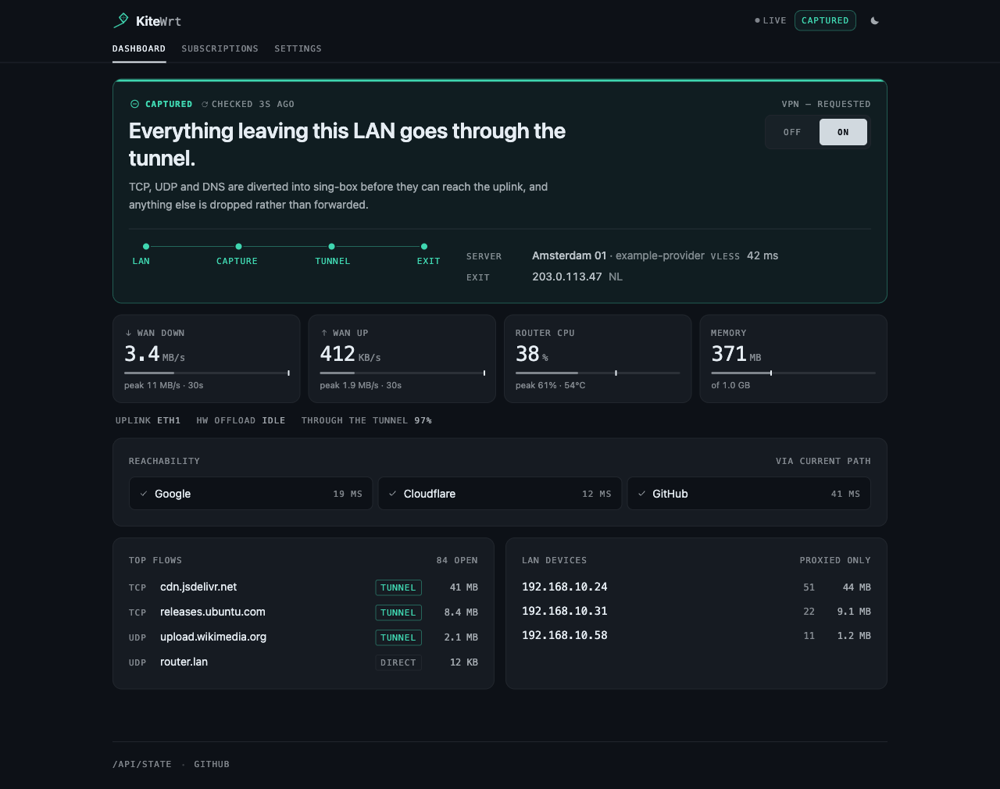
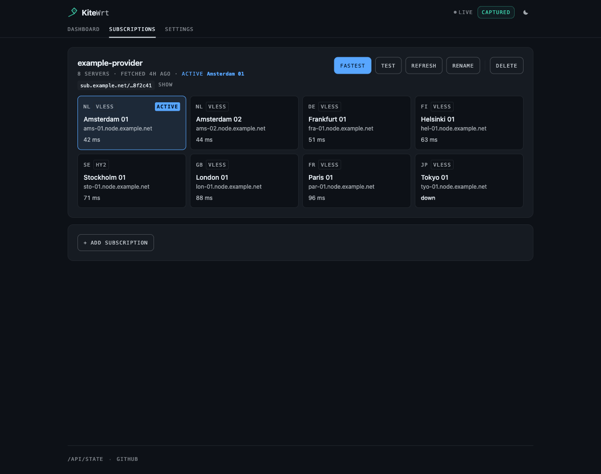

# KiteWrt

A self-hosted web UI on an **OpenWrt** router that turns a VLESS subscription into a transparent VPN for every device on the LAN. Pick a country, flip a switch, all your phones / laptops / TVs go through the chosen exit point — no per-device clients.

<picture>
  <source media="(prefers-color-scheme: light)" srcset="./docs/images/dashboard-protected-light.png">
  
</picture>

The UI follows your system's light/dark setting (there's a manual toggle in the header) — the shot above is in whichever one you're reading this in. That headline is not derived from the VPN switch: it reports what the watchdog last *observed* about the LAN capture, because "the VPN is on" and "your traffic is actually going through it" are different facts, and every silent failure this project has hunted lives in the gap between them. [What the UI does, and what it is claiming →](./docs/using-the-ui.md)

## ⚠️ Disclaimer

KiteWrt is a **generic management UI for sing-box** — it sets up the transparent-proxy plumbing and lets you point sing-box at a subscription (VLESS, Shadowsocks, VMess, Trojan, hysteria2/hysteria, TUIC) and your own routing rules. **It ships no servers, no routing/geo rules, and no block-lists** of any kind. You supply the VLESS subscription and the routing rules yourself (the rules can reference `type: remote` rule-sets that sing-box downloads at runtime — that data is never stored in or distributed by this project).

This is provided **as-is, with no warranty, for lawful purposes only**. You are solely responsible for how you use it and for complying with the laws and regulations that apply to you. Use at your own risk.

---

## Install

> Every example here uses **`192.168.8.1`**, the GL.iNet default. **Substitute your own router's LAN address** — stock OpenWrt is usually `192.168.1.1`. On a machine already on the LAN, `ip route | grep default` (Linux) or `route -n get default` (macOS) prints it.

### What you need

**On your machine** (macOS or Linux, on the same LAN as the router):

- [**uv**](https://docs.astral.sh/uv/) — it fetches the right Python and the installer's dependencies, so there's no virtualenv to manage:
  ```sh
  curl -LsSf https://astral.sh/uv/install.sh | sh
  ```
- `git`, to clone this repo.

**On the router:**

- **OpenWrt 21.02+**, including GL.iNet firmware, with `opkg`, `fw3`/`fw4` and `uci`. fw4/nftables (22.03+) works via the `iptables-nft` compat shim.
- **CPU `aarch64`, `x86_64` or `armv7`** — auto-detected; sing-box and uv each ship one build per arch.
- **~140 MB free overlay** (python3 + the deps + the sing-box binary) and **≥ 256 MB RAM**. Small-flash 8/16 MB devices won't fit python3 at all.
- **The iptables TPROXY target and full iproute2 (`ip-full`).** Both are hard requirements, and both are probed by *adding a real rule* rather than by asking `opkg`: without TPROXY nothing would be proxied, and busybox's built-in `ip` caps route-table IDs at 255 while the capture needs table 2023. The pre-flight installs each one if the feed has it and refuses to continue if it can't — this is exactly the failure that used to produce a green install on which nothing was ever tunnelled.
- **root SSH with a *password*.** The installer authenticates with a password only; a key-only router isn't supported. It prompts once (or reads `--password-env VAR`) and uses it for that one session.
- A working `opkg` feed, and — unless you use the [offline artifacts](./installer/artifacts/README.md) — reachable GitHub and PyPI *from the router*.
- Optional: `ipset` + the `xt_set` match. Without it the capture still works; `bypass_address` just does nothing.

**From you:** a subscription URL or a `vless://` link from whatever provider you use. KiteWrt ships none.

Seven targets have been installed from scratch and checked end to end — a LAN client reaching the internet *through* the tunnel, not merely a healthy daemon — from a 21.02 GL.iNet Flint 2 to stock 24.10 on three architectures. The matrix is in [docs/openwrt-notes.md](./docs/openwrt-notes.md#what-has-actually-been-run-and-on-what).

### Step 1 — Prepare the router (one-time, manual)

1. **Enable SSH/root access.** On GL.iNet: enable SSH in the admin UI (or LuCI → System → Administration) and set a root password. Verify with `nc -zv 192.168.8.1 22` (`succeeded`).
2. That's it — no USB drive, no firmware components, no reboot. Whatever the router is missing (`ip-full`, `iptables-mod-tproxy`, `ipset`, `curl`, `kmod-tcp-bbr`) the installer's pre-flight installs for you.

### Step 2 — Run the installer

```sh
git clone https://github.com/voledyaev/kitewrt.git
cd kitewrt
uv sync --extra installer
uv run kitewrt root@192.168.8.1
```

> **There is no `kitewrt` on your `PATH`.** The command lives in this repo's uv environment, so **every invocation is `uv run kitewrt …` from the clone** — including `--uninstall` and `--probe`. `kitewrt: command not found` means you ran it from somewhere else.

The installer asks for the SSH password once and uses it **only for the SSH session** that deploys everything. Nothing is stored on the router for runtime use — the daemon makes no authenticated calls back to the router firmware.

It prints six steps, `[1/6]` to `[6/6]`. The first run takes a few minutes: `opkg` fetches `python3`, uv installs the daemon's dependencies, and the sing-box binary comes down from GitHub. **Re-running is not much faster** — only sing-box is version-checked and skipped, so budget about a minute, not seconds. [What each step does →](./docs/installer.md#what-happens-in-order)

> **The installer changes one setting outside its own footprint: TCP congestion control becomes BBR.** That is *all* of the router's TCP, not just proxied traffic, persisted across reboots — and **it is not reverted by uninstall**. BBR holds throughput on the lossy, long-RTT paths a proxy uplink actually takes, where the default `cubic` collapses on loss; it's best-effort, and a kernel without the module keeps `cubic` with a warning. [The reasoning, and how to put it back →](./docs/installer.md#bbr-the-one-system-wide-setting-the-installer-changes)

If your ISP blocks GitHub or PyPI *from the router*, pre-download sing-box, uv and the wheels and drop them in `installer/artifacts/` — [three downloads happen on the router, and pre-placing only sing-box is the common mistake](./docs/installer.md#behind-a-blocked-github--pypi).

### Step 3 — Connect

Open **`http://192.168.8.1:8088/`** in any browser on the LAN — your router's address, port 8088 (8080 is taken by GL.iNet's own uhttpd). The port is DROPped from the WAN side on purpose, so this only works from the LAN.

1. Paste your **VLESS subscription URL** (the standard base64-encoded list of `vless://` lines most providers serve at a per-user URL). You can also add an inline `vless://...` link directly. Formats accepted: [docs/vless-format.md](./docs/vless-format.md).
2. Optionally paste a **routing-rules URL** — JSON in [sing-box's native route-rule format](./docs/rules-format.md). Without one, all traffic goes through the VPN — only private/LAN networks stay direct (required so the router and local devices stay reachable). Fine to start without it. An annotated example showing the format (a few domains + your home country direct, the rest via VPN) ships at [`examples/rules-example.json`](./examples/rules-example.json) — adapt it, host it somewhere reachable, and point the rules URL at it.
3. Pick a country.
4. Flip the **VPN** switch on. Every device on the LAN now exits through the chosen server, with foreign-domain DNS handled inside the tunnel (instant fake-IP for A/AAAA, DoH for the rest — Cloudflare by default, editable) and home/local domains resolved directly.

Steps 1 and 3 happen on the **Subscriptions** tab — one card per subscription, one tile per server, sorted by measured latency:



If the install or the first apply doesn't go cleanly, [docs/troubleshooting.md](./docs/troubleshooting.md) has the failures in the order you're likely to meet them — including the one where the LAN goes dark, which is the fail-closed design working rather than breaking.

---

## What's running on the router

Two long-lived processes: **sing-box** (proxy + DNS + routing, the whole data plane) and **`python3 -m kitewrt`** (the UI, the apply pipeline, the watchdog), both under procd. The daemon owns no packets. It generates `/etc/sing-box/config.json`, drives sing-box's Clash API for live changes — picking a country or flipping the switch is one API call, no restart — and installs the netfilter capture that steers LAN traffic into sing-box's `tproxy` inbound. It re-asserts that capture every 30 s, because on fw3 an `/etc/init.d/firewall restart` flushes it. A crash is fail-closed: captured traffic reaches a port with nothing behind it and is dropped, not leaked.

**`/etc/kitewrt/data/state.json` is the only copy of your subscriptions, their credentials, the DNS settings and the rules URL** — nothing else on the router or in this repo holds them. It survives a firmware upgrade, because `/lib/upgrade/keep.d/kitewrt` is registered for exactly that; the binaries don't, so re-run the installer after a sysupgrade. It does **not** survive `--uninstall`.

The full on-disk layout, the capture's rule ordering (every line of which is load-bearing), and the measurements behind using TPROXY instead of a `tun` — 3.54 Gb/s against the tun's 1.10, same binary, same outbound, only the inbound differing — are in [ARCHITECTURE.md](./ARCHITECTURE.md).

## Uninstall

```sh
cd kitewrt                                   # the repo you cloned
uv run kitewrt --uninstall root@192.168.8.1
```

> ### ⚠️ Uninstall deletes your configuration
>
> It removes **`/etc/kitewrt`**, and `/etc/kitewrt/data/state.json` is the only copy of your **subscriptions and their credentials**, your DNS settings and your rules URL. There is no backup and no prompt.
>
> That is deliberate — "no credentials left on disk" is the point of uninstalling — but it means **you must save your subscription URLs somewhere else first** if you ever intend to reinstall.
>
> Don't let the firmware-upgrade behaviour mislead you: `/etc/kitewrt` is registered in `/lib/upgrade/keep.d/` *specifically* so it survives a sysupgrade, and the installer says so as it runs. Surviving a firmware flash and surviving an uninstall are different things.

It also scrubs the generated sing-box config down to a credential-free one, removes the capture and the firewall sections, and leaves `python3`, `sing-box`, the pre-flight's packages and BBR in place. [The full end state →](./docs/installer.md#uninstall)

---

## Project docs

- [docs/using-the-ui.md](./docs/using-the-ui.md) — what every control does, what the dashboard is claiming, and the behaviours that surprise people (split DNS, QUIC, why ping fails)
- [docs/installer.md](./docs/installer.md) — the six install steps in detail, BBR, offline artifacts, and what uninstall removes
- [docs/troubleshooting.md](./docs/troubleshooting.md) — symptoms and fixes
- [ARCHITECTURE.md](./ARCHITECTURE.md) — components, data flow, design decisions
- [docs/openwrt-notes.md](./docs/openwrt-notes.md) — OpenWrt / fw3 / fw4 / procd platform notes, and the tested-target matrix
- [docs/vless-format.md](./docs/vless-format.md) — subscription / VLESS link parsing reference
- [docs/rules-format.md](./docs/rules-format.md) — accepted sing-box routing-rules JSON format
- [docs/measured-facts.md](./docs/measured-facts.md) — measured facts, known limits, and the open list
- [docs/development.md](./docs/development.md) — tests, the web build, CI, project layout
- [examples/rules-example.json](./examples/rules-example.json) — annotated routing-rules example

## License

[MIT](./LICENSE) © voledyaev
